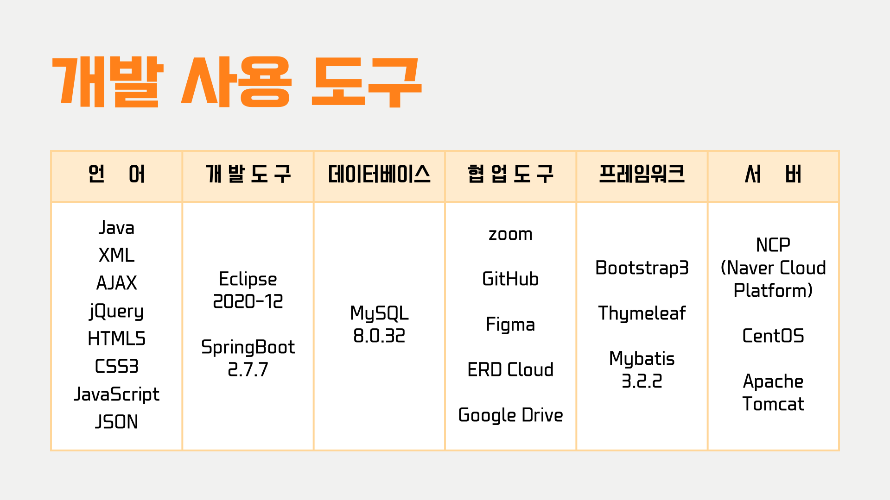
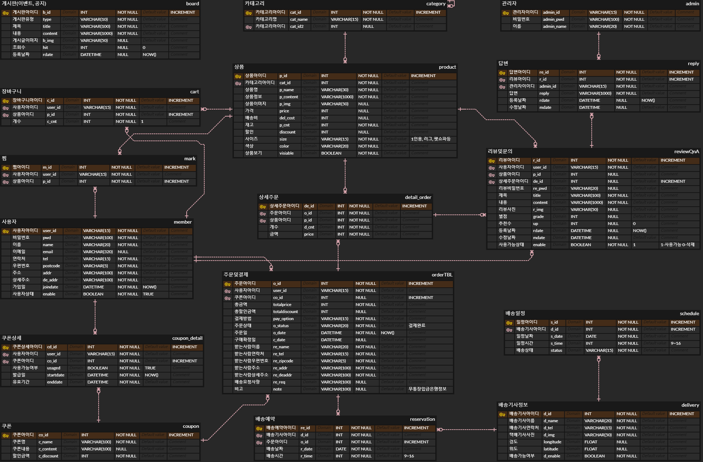

# SOF8
Multi-Campus Team Project Group8  'SOF8'

## 1. 프로젝트 주제
- 네이버 AI 플랫폼과 API(지도, 결제)를 활용하여 소파 상품 예약 및 배송 서비스를 제공하는 웹 애플리케이션 ‘ SOF8 : SOFA + Group8 ’

## 2. 프로젝트 목적
> 기능 및 협업  
- 사용자의 취향에 맞는 상품 주문 및 배송 예약 서비스를 이용할 수 있는 웹 애플리케이션을 개발하는 것
- 협업을 통해 반응형 웹사이트를 구현
- 숙박 예약 기능과 동행 서비스 기능에 맞는 화면 디자인 및 데이터베이스 설계
- 팀원 모두 프론트와 백엔드 프로세스를 이해하여 프로젝트 완성
- Thymeleaf, MyBatis 를 이용해 동적인 화면 구현
- MySQL을 이용하여 데이터 베이스를 구축하고 Spring Container와 연결
- 자바 개발도구와 통합개발환경(IDE : Intergarated Development Environment) 사용
- ERD Cloud와 Notion, Github을 사용한 협업 경험
> 차별점  
- 상품 주문시 다른 사이트와 차별점을 두기 위하여 사용자의 needs에 맞춰 배송 예약, 기간 및 시간을 설정할 수 있도록 구현

## 3. 시스템 구성도 / 개발 사용 도구

## 4. 데이터베이스 설계
> 16개의 테이블 사용   

## 5. 프로젝트 기능 구현
> USER PAGE  

> ADMIN PAGE  

## 6. 프로젝트 구성원 및 역할

## 7. 프로젝트 수행 기간
> 2023.01.06 ~ 2023.02.17(8주)
> [WBS(Work Breakdown Structure)](https://docs.google.com/spreadsheets/d/1l5RytZX4ybEn0ufmhfsFigrCAuVmxXFy/edit#gid=1506713151)

## 8. 프로젝트 핵심 기능
> 8 - 1. 결제(Iamprot)
> 아임포트 api를 사용하여 결제 기능 구현

> 8 - 2. 주문 결제 완료 시, 확인 email 발송  

> 8 - 3. 우편번호 검색 

> 8 - 4. 개인정보 암호화
> 회원가입시 개인정보 SHA-512방식의 단방향 암호화

## 9. 시연영상
 

## 10. 트러블 슈팅
| 이름 | 
Trouble                                                                                                                                                                                                                                                                                                                             | 
Solution                                                                                                                                                                                                                                                                                                                                                                                                                                                                                                                                                                                                                                                                                                                                                                        |
| :---: |---------------------------------------------------------------------------------------------------------------------------------------------------------------------------------------------------------------------------------------------------------------------------------------------------------------------------------------------|-----------------------------------------------------------------------------------------------------------------------------------------------------------------------------------------------------------------------------------------------------------------------------------------------------------------------------------------------------------------------------------------------------------------------------------------------------------------------------------------------------------------------------------------------------------------------------------------------------------------------------------------------------------------------------------------------------------------------------------------------------------------------------------------|
|김혜원| 상품 등록시 다중 이미지 저장에서 Thread 이슈 발생 | 반복문을 사용하지 않고 조건문을 이용하여 이미지 파일 저장 |
|박종훈| 공지사항 삭제 기능 구현 시 사용자가 URL을 알고 있다면 권한이 없음에도 삭제 가능
pagination 구현 시 데이터를 전부 가져와 javascript로 일정부분만 보이도록 구현 - 데이터가 많아질 경우 비효율 | 컨트롤러에서 session값 을 확인하여 관리자가 아니라면 "redirect:/"를 이용하여 홈페이지로 이동
팀원의 도움으로 DB에서 일부분만 가져와서 렌더링 하는 방식으로 변경 |
|서경진| 카카오 map api 사용 시, 계속해서 구글 map으로 출력 | 카카오 map, 구글 map 동시에 사용 시, 카카오 map사용 불가로 구글 map api 삭제    |
|임규남| 아이디 찾기 시 AJAX로 비동기 화면 전환 문제
비밀번호 찾기 화면에서 새로운 비밀번호 등록 시 아이디 값 전달 문제
주문목록 중간 페이지에서 출력된 목록을 전부 삭제후 해당 페이지로 돌아올 때 빈 목록이 출력되는 문제 | 컨트롤러에서 replcaceWith 할 fragment 값 리턴
세션을 통해 새로운 비밀번호를 등록할 아이디 값을 전달
do~while문을 사용하여 빈 목록일 경우 이전 페이지로 이동하는 로직 구현|
