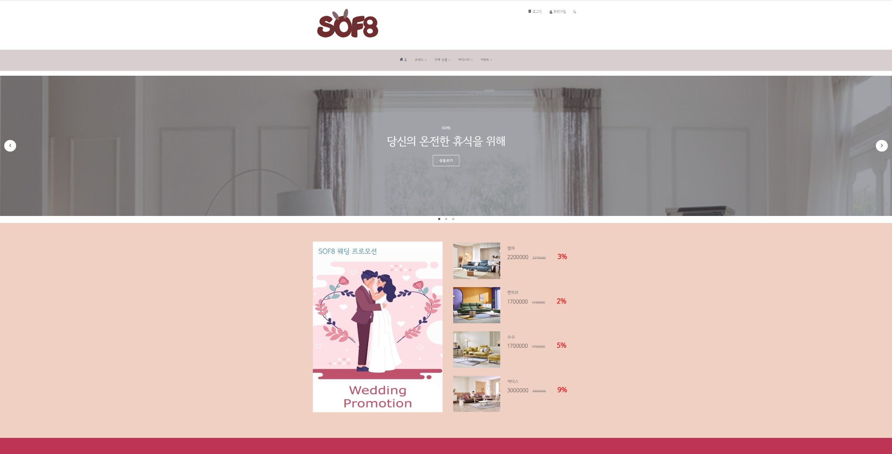

# SOF8
Multi-Campus Team Project Group8  'SOF8'

## 1. 프로젝트 주제
- 네이버 AI 플랫폼과 API(지도, 결제)를 활용하여 소파 상품 예약 및 배송 서비스를 제공하는 웹 애플리케이션 ‘ SOF8 : SOFA + Group8 ’

## 2. 프로젝트 목적
> 기능 및 협업  
- 사용자의 취향에 맞는 상품 주문 및 배송 예약 서비스를 이용할 수 있는 웹 애플리케이션을 개발하는 것
- 협업을 통해 반응형 웹사이트를 구현
- 숙박 예약 기능과 동행 서비스 기능에 맞는 화면 디자인 및 데이터베이스 설계
- 팀원 모두 프론트와 백엔드 프로세스를 이해하여 프로젝트 완성
- Thymeleaf, MyBatis 를 이용해 동적인 화면 구현
- MySQL을 이용하여 데이터 베이스를 구축하고 Spring Container와 연결
- 자바 개발도구와 통합개발환경(IDE : Intergarated Development Environment) 사용
- ERD Cloud와 Notion, Github을 사용한 협업 경험
> 차별점  
- 상품 주문시 다른 사이트와 차별점을 두기 위하여 사용자의 needs에 맞춰 배송 예약, 기간 및 시간을 설정할 수 있도록 구현

## 3. 시스템 구성도 / 개발 사용 도구

|                            언어                            |                 개발도구                  |    Database    |                           협업도구                           |          Framework          |         Server          |
|:--------------------------------------------------------:|:-------------------------------------:|:--------------:|:--------------------------------------------------------:|:---------------------------:|:-----------------------:|
| Java XML AJAX jQuery HTML5 CSS3 JavaScript JSON | Eclipse 2020-12 SpringBoot 2.7.7 | MySQL 8.0.32  | zoom GitHub Figma ERD Cloud Google Drive | Thymeleaf Mybatis 3.2.2 | NCP(Naver Cloud Platform) Apache Tomcat |

 

## 4. 데이터베이스 설계
> 16개의 테이블 사용   

## 5. 프로젝트 기능 구현
> USER PAGE  

> ADMIN PAGE  

## 6. 프로젝트 구성원 및 역할
| 이름 |                                      
USER PAGE                                      |
ADMIN PAGE|
| :---: |:-------------------------------------------------------------------------------------------:|:---:|
|공통|                       
ERD 설계 및 각 테이블 DTO,CRUD 구현, API 데이터 확인                        ||
|김혜원| 
메인, 회원가입, 로그인, 쿠폰, 예약/결제 페이지 웹소켓을 통한 실시간 예약반영 기능 NCP chatbot 기능을 이용한 챗봇 문의 기능 |회원가입, 로그인, 나라별 수요 통계차트 페이지|
|박종훈|          
공지사항, 자주하는문의,  1:1문의(등록/수정/삭제)/내역, 리뷰관리(등록/수정)          |공지사항(등록/수정), 1:1문의목록(답변등록/수정)|
|서경진|                      
회사소개, 오프라인매장, 쇼룸안내, 이벤트, 쿠폰, 내쿠폰                      |이벤트관리(등록/수정/삭제), 쿠폰관리(등록/수정/삭제)|
|임규남|                      
메인(영상), 회원가입(메일), 로그인, 아이디/비밀번호 찾기(메일), 마이페이지, 회원정보 수정/탈퇴, 찜목록(삭제), 주문목록(조회/주문취소)                      |회원가입, 로그인, 회원관리(조회/수정/탈퇴/삭제), 콘솔(대쉬보드), 콘솔(차트)|

## 7. 프로젝트 수행 기간
> 2023.01.06 ~ 2023.02.17(8주)
> [WBS(Work Breakdown Structure)](https://docs.google.com/spreadsheets/d/1l5RytZX4ybEn0ufmhfsFigrCAuVmxXFy/edit#gid=1506713151)

## 8. 시연영상
 

## 9. 트러블 슈팅
| 이름 | 
Trouble                                                                                                                                                                                                                                                                                                                             | 
Solution                                                                                                                                                                                                                                                                                                                                                                                                                                                                                                                                                                                                                                                                                                                                                                        |
| :---: |---------------------------------------------------------------------------------------------------------------------------------------------------------------------------------------------------------------------------------------------------------------------------------------------------------------------------------------------|-----------------------------------------------------------------------------------------------------------------------------------------------------------------------------------------------------------------------------------------------------------------------------------------------------------------------------------------------------------------------------------------------------------------------------------------------------------------------------------------------------------------------------------------------------------------------------------------------------------------------------------------------------------------------------------------------------------------------------------------------------------------------------------------|
|김혜원| 프로젝트를 생성하여 테스트를 진행하려고 할 때에 테스트가 진행되지 않음, 원인은 프로젝트 생성시 패키지 명에 예약어인 'final'을 사용함
유저 페이지에서 회원가입을 할 때의 생일을 날짜 형식인 DATE 로 받아오는것에 오류 발생, 원인은 데이터 형식이 맞지 않는다는 오류
 naver 로그인 연동시 개인 정보 
 카카오 로그인이 안 된 이유                                                                                                               |  패키지 명을 'multi'로 수정하여 재생성 후 테스트 진행되는 것을 확인하여 깃 리포지토리와 연결  
 @DateTimeFormat(pattern = "yyyy-MM-dd")를 사용하여 데이터 형식을 맞추어서 회원가입 가능하도록 수정  
  naver 로그인 연동할 때사용자의 birthyear, mobile정보를 알기 위해서는 jdk1 버전이 아닌 jdk2 버전을 사용해야 함  
 name을 안 담고 사용하고자 하여 nullexception이 나왔고 birthday 형식이 "mm-dd"가 아닌 "mmdd"을 사용                                                                                                                                                                                                                                                                                                                                                                                                                                    |
|박종훈| 공지사항 삭제 기능 구현 시 사용자가 URL을 알고 있다면 권한이 없음에도 삭제 가능 | 컨트롤러에서 session값 을 확인하여 관리자가 아니라면 "redirect:/"를 이용하여 홈페이지로 이동 |
|서경진| git |    |
|임규남| 아이디 찾기 시 AJAX로 비동기 화면 전환 문제
비밀번호 찾기 화면에서 새로운 비밀번호 등록 시 아이디 값 전달 문제  | 컨트롤러에서 replcaceWith 할 fragment 값 리턴 
세션을 통해 새로운 비밀번호를 등록할 아이디 값을 전달|
